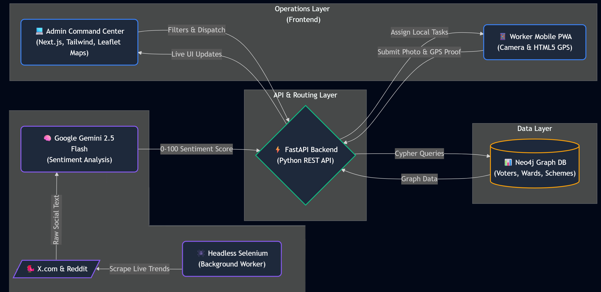
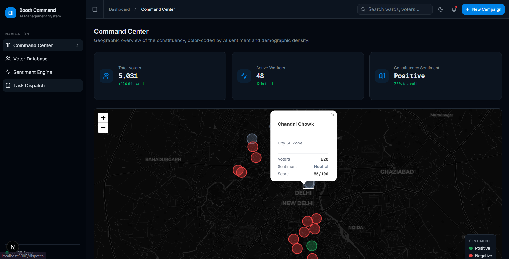
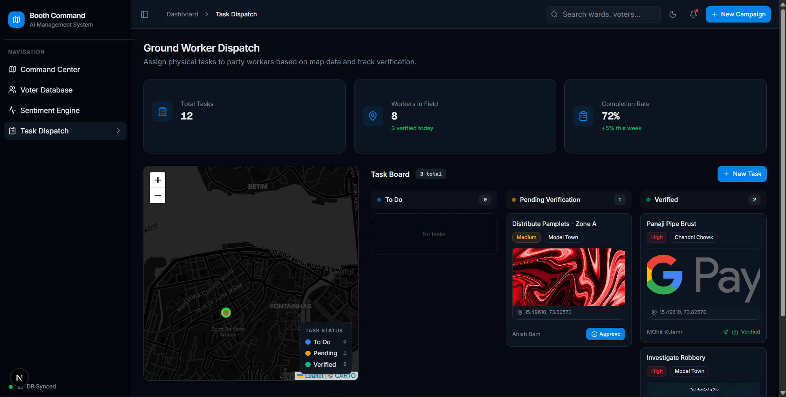
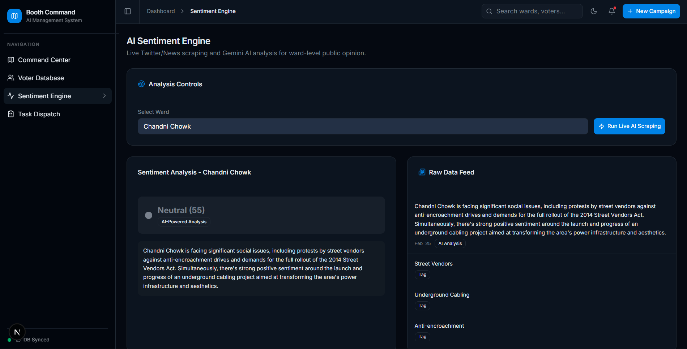
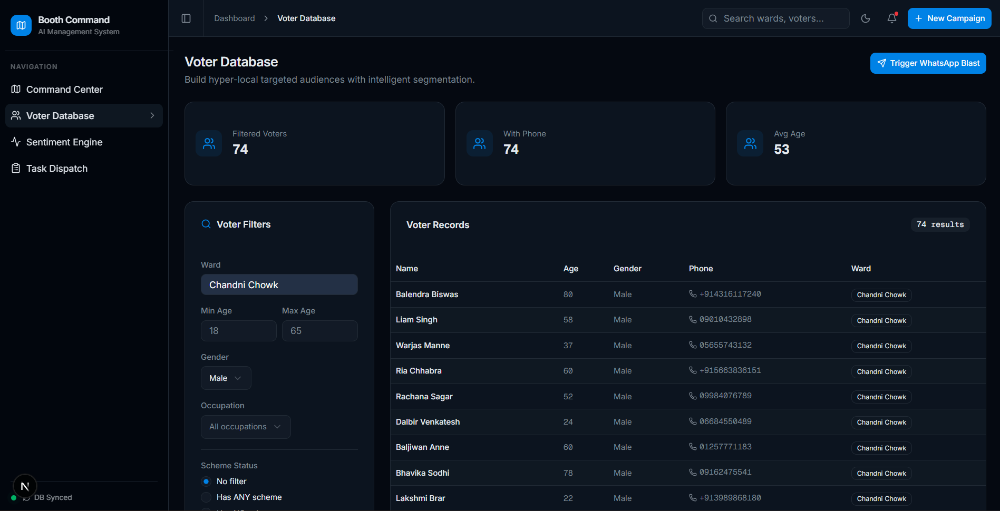

# 🏛️ Booth Command: AI-Driven Political Operations Engine

-blue)


> **Booth Command** is a closed-loop political operating system that transforms static voter lists into a living Knowledge Graph, utilizing headless AI to track local sentiment and mobile GPS validation to enforce strict ground-worker accountability.

## 🏗️ System Architecture



## 📸 Platform Previews

### 🌍 Admin Command Center & Map


### 📱 Worker Dispatch & GPS Verification


## 👾 Public Sentiment Analysis


## 👤 Search Through Database


## 🚀 Current Status: Phase 1 Prototype
*This repository contains the Phase 1 build for the hackathon submission. We are currently actively developing Phase 2 for the final presentation.*

### ✅ Completed Features (Phase 1)
* **The Knowledge Graph:** Neo4j database replacing traditional SQL to map complex `(Voter)-[:LIVES_IN]->(Ward)-[:BENEFITS_FROM]->(Scheme)` relationships.
* **Live Sentiment Engine:** A persistent, headless Selenium background worker that scrapes X.com and Reddit data, feeding it to **Google Gemini 2.5 Flash** to extract ward-level 0-100 sentiment scores.
* **Micro-Accountability Dispatch:** A Next.js Kanban board for admins, connected to a mobile-responsive PWA that forces ground workers to upload HTML5 GPS coordinates and live photos to verify task completion.
* **Interactive Command Center:** React-Leaflet integration projecting live demographic and sentiment data onto a dark-mode, coordinate-based map.

### 🚧 Roadmap (Phase 2 - Upcoming)
* **Aadhar/Digilocker Integration:** Secure, verified login for citizens to prevent bot spam and verify true constituents.
* **Citizen Ticketing System:** A direct portal for voters to raise issues directly to the local admin dashboard.
* **Crowdsourced "Before & After" Verification:** Automated SMS links sent to local ward residents allowing them to rate a completed ground task (1-5 stars) to guarantee ultimate political transparency.

## 💻 Tech Stack
* **Frontend:** Next.js 14 (App Router), React, Tailwind CSS, shadcn/ui, React-Leaflet, SWR.
* **Backend:** FastAPI (Python), Uvicorn.
* **Database:** Neo4j (Cypher Query Language).
* **AI & Automation:** Google Gemini 2.5 Flash API, Selenium WebDriver, BeautifulSoup4.

## Note : That I have removed the api keys to my gemini, if you want to use this project then please use your own api keys, thank you for your attention
## 🛠️ Local Setup Instructions

### 1. Database (Neo4j)
1. Install Neo4j Desktop or use Neo4j AuraDB.
2. Set up a local database with the password `anonymous123` (or update the `URI` and `AUTH` in `main.py`).

### 2. Backend (FastAPI)
```bash
# Navigate to backend directory (if separated)
pip install fastapi uvicorn neo4j selenium webdriver-manager bs4 google-generativeai pydantic
uvicorn main:app --reload
```

### 3. Frontend (Next.js)
```bash
npm install pnpm
pnpm install
pnpm dev
```
